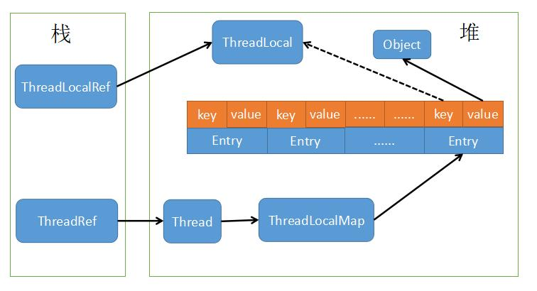

# ThreadLocal总结

# 前言

​	本文仅供复习参考，看了源码，也查了很多资料和博客，很多地方比如ThreadLocalMap的扩容之类的并没有总结。不对的地方请指正，作者再去更改。

## ThreadLocal简介

​	在JMM模型中，多线程去操作主内存的值时会出现线程安全性问题，在这种情况下，要么像volatile作用一样，将主内存的值立即刷新并更新到本线程的本地内存（这里说的比较简单，因此不太准确），要么就对主内存加锁，而ThreadLocal的存在提供了一种新的方式去保证线程安全性。

​	对于每个线程来说，操作自己那部分内存的数据就不会产生线程安全性问题，例如在方法中定义的变量就是线程安全的。JDK提供了ThreadLocal这个工具类，当使用了该工具类后，每个线程操作的数据都是线程私有的，相当于将变量的副本提供给了每一个线程。

## ThreadLocal简单使用

​	先来看看线程不安全的情况：

~~~java
public class ThreadLocalTest {

    static int n = 0;

    public static void main(String[] args) {
        for (int i = 0; i < 3; i++) {
            Thread t = new Thread() {
                @Override
                public void run() {
                    addNum();
                }
            };
            t.start();
        }
    }

    public static void addNum() {
        for (int i = 0; i < 3; i++) {
            n ++;
            System.out.println(Thread.currentThread().getName() + "---" + n);
        }
    }
}
~~~

~~~Text
Thread-0---2
Thread-1---2
Thread-0---3
Thread-0---5
Thread-1---4
Thread-1---6
Thread-2---7
Thread-2---8
Thread-2---9
~~~

​	上面例子是明显线程不安全的。现在来看加上ThreadLocal的例子：

~~~java 
public class ThreadLocalTest {

    static int n = 0;
	
   	// 给ThreadLocal一个初始化的值
    static ThreadLocal<Integer> threadLocal = ThreadLocal.withInitial(() -> n);

    public static void main(String[] args) {
        // 创建三个线程
        for (int i = 0; i < 3; i++) {
            Thread t = new Thread() {
                @Override
                public void run() {
                    addNum();
                }
            };
            t.start();
        }
    }

    public static void addNum() {
        for (int i = 0; i < 3; i++) {
            // 从ThreadLocal里拿取变量
            Integer j = threadLocal.get();
            j += 1;
            // 将变量放入ThreadLocal里
            threadLocal.set(j);
            System.out.println(Thread.currentThread().getName() + "---" + j);
        }
    }
}
~~~

~~~text
Thread-0---1
Thread-1---1
Thread-1---2
Thread-1---3
Thread-2---1
Thread-2---2
Thread-2---3
Thread-0---2
Thread-0---3
~~~

​	可以看出，每个线程最终打印出的就是3，不会出现对公共变量进行累加的情况。

## ThreadLocal实现原理

​	通过上面的例子，可以看出ThreadLocal的用法十分简单，并且十分像集合这种结构，get拿数据，set存数据。通过源码（后面分析）可以看到，也确实是个Map的结构，并且这个Map是在Thread里的，而不是ThreadLocal里。相当于ThreadLocal只是作为了一个工具去帮助线程将操作变量存到线程中的Map里。而这样的设计是不容易产生内存泄露的（只是不容易，后面会提到内存泄露问题）。

​	我们知道，如果ThreadLocal去持有这个Map的话，就相当于产生了一个强引用关系，而强引用关系只有主动释放内存（值为null）GC才能去回收。假设ThreadLocal对象一直存在，那么Map对象也会一直存在，Map对象中存的线程就无法被回收（这里是假设Map在ThreadLocal中，如果要实现ThreadLocal的作用，Map里可能要存线程和变量的键值对关系）。

​	在JDK的实现中，Thread对象持有ThreadLocalMap：

~~~java 
public class Thread implements Runnable {
    ......
	ThreadLocal.ThreadLocalMap threadLocals = null;
	......
}
~~~

​	ThreadLocalMap实质是一个创建在ThreadLocal中的静态内部类，其核心是其中的Entry类，而Entry对ThreadLocal的引用还是弱引用，且key值为ThreadLocal：

~~~java
public class ThreadLocal<T> {
    ......
	static class ThreadLocalMap {
        static class Entry extends WeakReference<ThreadLocal<?>> {
            Entry(ThreadLocal<?> k, Object v) {
                super(k);
                value = v;
            }
        	......
        }
        ......
    }
    ......
}
~~~

​	Thread，ThreadLocal，ThreadLocalMap关系如下图：

## 源码分析

### ThreadLocal.set()

~~~java 
public class ThreadLocal<T> {
    ......
	public void set(T value) {
        // 获取当前线程
        Thread t = Thread.currentThread();
        // 拿到当前线程的Map
        ThreadLocalMap map = getMap(t);
        if (map != null)
            // 如果当前线程的map不为Null,将值放入map中
            map.set(this, value);
        else
            // 重新创建一个map
            createMap(t, value);
    }
    ......
}
~~~

​	跟踪这个set的方法：

~~~java
public class ThreadLocal<T> {
    ......
	static class ThreadLocalMap {
        ......
    	private void set(ThreadLocal<?> key, Object value) {

            // We don't use a fast path as with get() because it is at
            // least as common to use set() to create new entries as
            // it is to replace existing ones, in which case, a fast
            // path would fail more often than not.
            
            Entry[] tab = table; 
            int len = tab.length;
            // ThreadLocalMap其实也是和HashMap一样，set值要通过hash来算出要将值放入哪个Entry中
            int i = key.threadLocalHashCode & (len-1);
			// 开始遍历Map中的Entry
            for (Entry e = tab[i];
                 e != null;
                 e = tab[i = nextIndex(i, len)]) {
                // 通过引用关系拿到Entry的key值
                ThreadLocal<?> k = e.get();
				// 1.如果遍历到这个位置（Hash后的）发现值相同就更新替换
                if (k == key) {
                    e.value = value;
                    return;
                }
				// 2.如果遍历到这个位置发现有空位，就将值set进去
                if (k == null) {
                    replaceStaleEntry(key, value, i);
                    return;
                }
            }
			// 遍历完了发现上面1，2都不满足，就往原来Entry[]数组中向后加一个空槽
            tab[i] = new Entry(key, value);
            int sz = ++size;
            if (!cleanSomeSlots(i, sz) && sz >= threshold)
                // 因为加了一个空槽，就重新hash将值放进去
                rehash();
        }
    	......
    }
}
~~~

​	可以看到，大体上就是先拿到当前线程私有的ThreadLocalMap，然后将变量副本存入到Entry中，而Entry的键则是ThreadLocal，同时，Entry和ThreadLocal也是弱引用关系（这个很关键，分析完重要的源码后面会讲下）。

### ThreadLocal.get()

~~~java 
public class ThreadLocal<T> {
    ......
	public T get() {
        // 获取当前线程
        Thread t = Thread.currentThread();
        // 拿到当前线程里的ThreadLocalMap
        ThreadLocalMap map = getMap(t);
        if (map != null) {
            // 如果map不为null，直接通过当前ThreadLocal对象拿到对应的Entry
            ThreadLocalMap.Entry e = map.getEntry(this);
            if (e != null) {
                @SuppressWarnings("unchecked")
                  // 如果entry存在，就可以直接取出值
                T result = (T)e.value;
                return result;
            }
        }
        // 如果map或者entry不存在，就初始化构造一个map
        return setInitialValue();
    }
    ......
}
~~~

~~~java 
public class ThreadLocal<T> {
    ......
	static class ThreadLocalMap {
        ......
    	private Entry getEntry(ThreadLocal<?> key) {
            // 计算hash
            int i = key.threadLocalHashCode & (table.length - 1);
            // 取出对应hash的entry
            Entry e = table[i];
            // 判断该位置的entry是不是所要的
            if (e != null && e.get() == key)
                return e;
            else
                return getEntryAfterMiss(key, i, e);
        }
   	......
    }
}
~~~

~~~java
public class ThreadLocal<T> {
    ......
	static class ThreadLocalMap {
        ......
    	private Entry getEntryAfterMiss(ThreadLocal<?> key, int i, Entry e) {
            Entry[] tab = table;
            int len = tab.length;

            while (e != null) {
                ThreadLocal<?> k = e.get();
                if (k == key)
                    return e;
                if (k == null)
                    // 这步很关键，如果key值为null，就会清除掉这个entry以及其value值
                    expungeStaleEntry(i);
                else
                    i = nextIndex(i, len);
                e = tab[i];
            }
            return null;
        }
   	......
    }
}
~~~

### ThreadLocal.remove()

~~~java 
public class ThreadLocal<T> {
    ......
	public void remove() {
         // 获取当前线程的map
         ThreadLocalMap m = getMap(Thread.currentThread());
         if (m != null)
             // 移除
             m.remove(this);
     }
    ......
}
~~~

​	进到remove方法中：

~~~java
public class ThreadLocal<T> {
    ......
	static class ThreadLocalMap {
        ......
    	private void remove(ThreadLocal<?> key) {
            // 前面和set一样，计算Hash
            Entry[] tab = table;
            int len = tab.length;
            int i = key.threadLocalHashCode & (len-1);
            for (Entry e = tab[i];
                 e != null;
                 e = tab[i = nextIndex(i, len)]) {
                if (e.get() == key) {
                    // 将该位置的引用设置为null，方便GC回收
                    e.clear();
                    // 将该位置的entry值或者本身设置为null，清除该位置的entry
                    expungeStaleEntry(i);
                    return;
                }
            }
        }
   	......
    }
}
~~~

## 弱引用与内存泄露

### 弱引用关系

​	之前说过，源码中Entry和ThreadLocal为弱引用关系。先再来看下关系图：

​	按照思路，Thread里面有ThreadLocalMap，然后ThreadLocalMap使用Entry这种结构来存变量，那么为什么key值就要设置为弱引用呢？

​	先看下弱引用的定义：在垃圾回收器线程扫描它所管辖的内存区域的过程中，一旦发现了只具有弱引用的对象，不管当前内存空间足够与否，都会回收它的内存。不过，由于垃圾回收器是一个优先级很低的线程，因此不一定会很快发现那些只具有弱引用的对象。

​	- 清楚了定义，我们先假设一下如果是强引用：

	1. 当我们要回收ThreadLocal的时候，即设置threadLocal = null，我们希望GC能去回收它。但是由于Entry和ThreadLocal是强引用关系，GC做根可达分析时仍然能通过Thread--ThreadLocalMap--Entry--ThreadLocal来找到ThreadLocal，因此该对象在这种情况下根本无法被回收。

 	2. 当线程出现死循环情况时，引用链就会一直存在，无法回收内存。

​    - 假设是弱引用：

	1. 当要回收ThreadLocal的时候，GC扫描到具有弱引用的对象，ThreadLocal对象会被回收。
 	2. 当线程出现死循环的情况时，设置ThreadLocal = null，则GC回收该对象，然后Entry的key值就为null，通过4.2的源码，key值为null，就会调用expungeStaleEntry()方法清除它的内存数据。

### 内存泄露

​	先看下内存泄露的定义：内存泄漏（Memory Leak）是指程序中已动态分配的堆内存由于某种原因程序未释放或无法释放，造成系统内存的浪费，导致程序运行速度减慢甚至系统崩溃等严重后果。

​	现在分析一下可能出现内存泄露的场景：现在要回收ThreadLocal，于是设置为null，让GC去回收。现在GC回收了该实例，Entry里的key值为null了，但是，value值仍然存在，并且由于key值不存在了，无法通过key值去找到该部分的value，这就产生了内存泄露。

​	尽管在4.2的源码中我们看到，当判断到key为null的时候，就会调用expungeStaleEntry()方法去清除该部分的Entry，并且set里也会在判断key为null时调用这个方法，我们还是最好去手动释放该部分内存数据，主动使用remove方法去防止内存泄露的情况产生。

