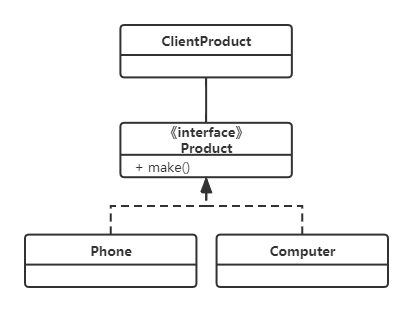
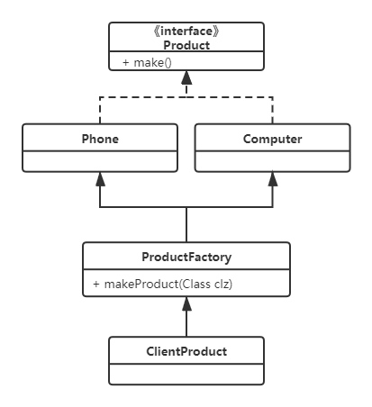
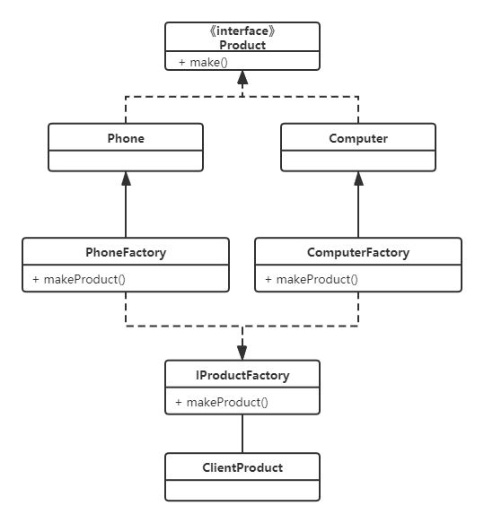
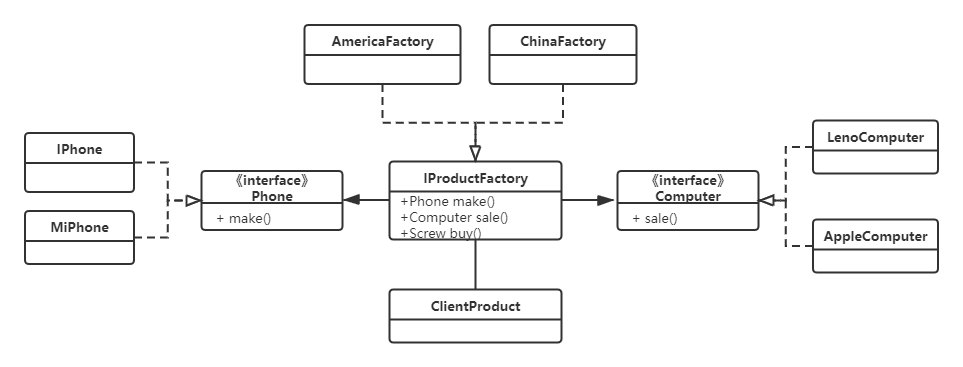
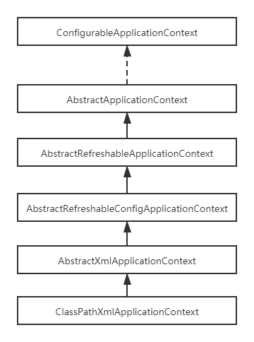
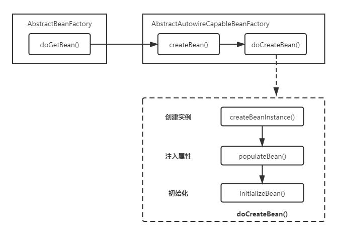
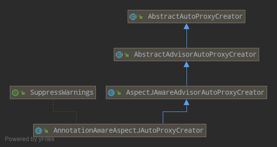
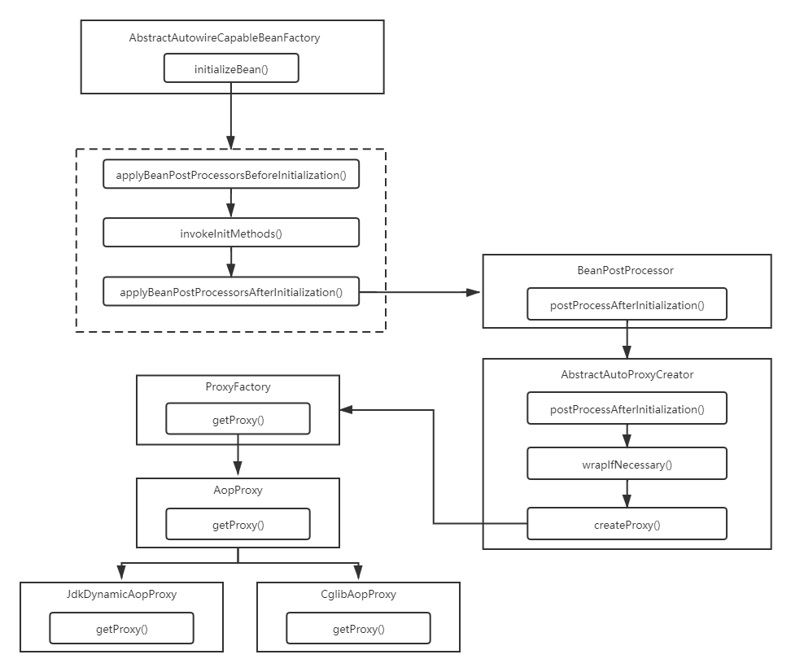

# Spring源码中的设计模式

# 前言

​	由于spring源码很多，每个部分涉及到的设计模式也很多，所以这里总结肯定有遗漏的部分，但是应付秋招应该够了......

​	以后对spring理解更深了，会去完善这个文档，代码部分有问题的或者对源码上面注释部分有问题的也请指教，源码上的注释是根据个人理解去注释的。第一次总结只当是应付应付了。

​	本文不会对涉及到的spring的源码类的作用做详细说明，spring的源码真的很厉害，我的水平不够，只对spring的几个部分读了几遍，所以重点还是在于spring中所使用到的设计模式，以后会对spring源码做总结。

## 工厂模式

### 工厂模式是什么

​	在开发中，创建对象时通常不对客户端暴露创建逻辑，而是通过一个共同的接口来指向新创建的对象。

​	先来看看之前的逻辑：

​	定义一个产品类的接口，里面有制作产品的方法make

~~~Java
public interface Product {
    void make();
}
~~~

​	现在要制作电脑和手机两个产品，于是实现该接口

~~~Java
public class Phone implements Product {

    public void make() {
        System.out.println("手机制作");
    }
}
~~~

~~~java
public class Computer implements Product{

    public void make() {
        System.out.println("电脑制作");
    }
}
~~~

​	于是在客户端模拟制作两个产品

~~~java
public class ClientProduct {

    public static void main(String[] args) {
        Product phone = new Phone();
        phone.make();
        Product computer = new Computer();
        computer.make();
    }
}
~~~

​	该模式可以看出，如果产品工厂又增加了十几种产品，那么对于使用者来说，就要在客户端再创建十几种产品，增加了使用者的困难程度（上述代码只是小困难，实际开发过程中，假设每个创建对象的过程都有一大堆逻辑，那么客户端就要增加一大堆逻辑）。后面将用工厂模式的方法改造上述制作产品方式。

​	该制作方式的类图：



### 简单工厂模式

​	根据工厂模式的定义，创建对象的时候，不对客户端暴露，而上面例子里，在客户端里new Phone()或者Computer()。因此，简单工厂模式只需要提供一个具体实例的描述，就能创建该描述的对象。而这些实例的描述，都放在一个工厂里进行判断，由工厂判断实例逻辑返回实例。

​	改造如下，添加一个工厂类，这个类的作用就是向客户端屏蔽掉创建对象的细节：

~~~java
public class ProductFactory {
    // 该方法的作用就是创建对象，注意，该方法返回的就是产品的具体实现
    // 这里实例的描述就是 对象的名称
    public static Product makeProduct(String name){
        Product t = null;
        if("电脑".equals(name)){
            return new Computer();
        }else if("手机".equals(name)){
            return new Phone();
        }
        return t;
    }
}
~~~

​	对于客户端，就不需要new 对象了：

~~~java
public class ClientProduct {

    public static void main(String[] args) {
        // 这里需要创建什么对象只需要提供实例的描述
        Product phone = ProductFactory.makeProduct("电脑");
        Product computer = ProductFactory.makeProduct("手机");
        phone.make();
        computer.make();
    }
}
~~~

​	可以看出，简单工厂模式就是利用了java多态的特性来实例化不同的对象。

​	相比于1.1中的例子，简单工厂模式向使用者屏蔽了创建对象的过程，使用者可以不用关心对象是如何创建的，只需要提供实例的描述，使得开发与使用的职责更加明确；此外该模式更加符合面向接口编程，而不是面向实现编程。

​	但是缺点也是显而易见的：

​		1.在工厂类里面堆积大量的对象创建逻辑，即一个工厂负责了所有对象的创建，如果工厂出现问题，所有对象创建都会出现问题。

​		2.当需要增加新产品的时候，虽然不需要使用者去创建对象了，但是工厂类仍然要去修改代码，这违反了开放封闭原则（对扩展的开放，对修改的关闭）。

​	当然，上述缺点的第二条也好解决，对简单工厂模式本身改造如下：

~~~java
public class ProductFactory {
   
    public  static Product makeProduct(Class clz){
        Product t = null;
        try {
            // 这里通过反射来拿到唯一的对象
            t = (Product) Class.forName(clz.getName()).newInstance();
        }catch (Exception ex){
            ex.printStackTrace();
        }
        return t;
    }
}
~~~

~~~java
public class ClientProduct {

    public static void main(String[] args) {
        Product phone = ProductFactory.makeProduct(Phone.class);
        Product computer = ProductFactory.makeProduct(Computer.class);
        phone.make();
        computer.make();
    }
}
~~~

​	在java中，创建对象的方式除了直接new 对象外，使用反射也能拿到对象。利用反射拿到在类加载时生成的class对象，在运行时动态获取对象，这样即使添加再多的产品，也不会影响到工厂类的代码。

​	该制作方式的类图：



### 工厂方法模式

​	如果不使用反射去解决第二条缺点，就要去改造简单工厂模式，使用工厂方法模式。

​	工厂方法模式是通过工厂父类定义负责创建的接口，子类来实现接口负责生产的对象。这样工厂类就不需要修改，只用修改工厂子类。当增加一个产品的时候，只需要增加生产该产品的工厂实现。

​	改造如下，新增一个父类的工厂接口

~~~java
public interface IProductFactory {
    Product makeProduct();
}
~~~

​	针对不同产品创造不同工厂

~~~java
public class ComputerFactory implements IProductFactory{
    public Product makeProduct() {
        return new Computer();
    }
}
~~~

~~~java
public class PhoneFactory implements IProductFactory{
    public Product makeProduct() {
        return new Phone();
    }
}
~~~

​	客户端只需要调用不同的工厂去制作产品

~~~java
public class ClientProduct {

    public static void main(String[] args) {
        IProductFactory phoneFactory = new PhoneFactory();
        phoneFactory.makeProduct().make();
        IProductFactory computerFactory = new ComputerFactory();
        computerFactory.makeProduct().make();
    }
}
~~~

​	相对于简单工厂模式（非反射），工厂方法模式更加符合开闭原则，增加新产品时只需要增加相应的产品工厂，不需要修改工厂中的代码。但这个也是该模式的缺点，当产品足够多的时候，就需要增加足够多的工厂和产品，使得类的数量大量增加。

​	此模式下类图：



### 抽象工厂模式

​	抽象工厂模式是指当有多个抽象角色时，使用的一种工厂模式。这里的抽象角色就是产品族。产品族是具有相同属性的同类型产品；如宝马车，宝马1系，宝马2系，都属于宝马；抽象工厂，非常适合解决两个维度的组合产品的构造问题，取其中一个维度作为产品族，另外一个维度作为产品族中具体的多个产品。

​	在工厂方法模式下，假如出现多个产品族，那就得对任何产品族的成员添加工厂类，增加了许多类文件，因此，抽象工厂模式的任务就是将产品公用的属性抽象出来，减少类文件。

​	假设上面例子的手机和电脑分别有IPhone，MiPhone，联想电脑和苹果电脑

```java
public interface Phone {
    void make();
}

public class IPhone implements Phone {
    @Override
    public void make() {
        System.out.println("制作苹果手机");
    }
}

public class MiPhone implements Phone{
    @Override
    public void make() {
        System.out.println("制作小米手机");
    }
}

```

~~~java
public interface Computer {
    void sale();
}

public class LenoComputer implements Computer{

    @Override
    public void sale() {
        System.out.println("卖联想电脑");
    }
}

public class AppleComputer implements Computer {
    @Override
    public void sale() {
        System.out.println("卖苹果电脑");
    }
}
~~~

​	手机和电脑对于产品工厂来说，一个要制作一个要卖：

~~~java
public interface IProductFactory {

    Phone make();

    Computer sale();
}
~~~

​	现在，总产品工厂决定了，在中国和美国开两个工厂，分别卖和制作两种产品：

~~~java
public class ChinaFactory implements IProductFactory{
    @Override
    public Phone make() {
        return new MiPhone();
    }

    @Override
    public Computer sale() {
        return new AppleComputer();
    }
}

public class AmericaFactory implements IProductFactory{
    @Override
    public Phone make() {
        return new IPhone();
    }

    @Override
    public Computer sale() {
        return new LenoComputer();
    }
}
~~~

​	对于客户端来说，如果需要制作IPhone和卖联想电脑，只需要去美国工厂去做就行了：

~~~java
public class ClientProduct {

    public static void main(String[] args) {
       	// 决定好工厂
        IProductFactory factory = new AmericaFactory();
        // 制作和卖那个工厂的产品
        factory.make().make();
        factory.sale().sale();
    }
}
~~~

​	假设现在总工厂要增加一个日本工厂，日本工厂的职能就是制作小米手机和卖联想电脑：

~~~java
public class JapanFactory implements IProductFactory{
    @Override
    public Phone make() {
        return new MiPhone();
    }

    @Override
    public Computer sale() {
        return new LenoComputer();
    }
}
~~~

​	客户端在调用的时候，只需要再选择日本工厂就可以了。

​	假设现在总工厂缺少螺丝了，需要各个国家的工厂在各个地方先买螺丝，就先创建材料这个父类，然后创建螺丝这个产品，然后让各个工厂去购买

~~~java
public interface Material {
    void buy();
}
~~~

~~~java
public class AmericaScrew implements Material {
    @Override
    public void buy() {
        System.out.println("在美国买螺丝");
    }
}

public class ChinaScrew implements Material{
    @Override
    public void buy() {
        System.out.println("在中国买螺丝");
    }
}
~~~

~~~java
public class AmericaFactory implements IProductFactory{
    @Override
    public Phone make() {
        return new IPhone();
    }

    @Override
    public Computer sale() {
        return new LenoComputer();
    }
	
    
    // 增加美国厂的购买
    @Override
    public Material buy() {
        return new AmericaScrew();
    }
}
~~~

~~~java
public class ChinaFactory implements IProductFactory{
    @Override
    public Phone make() {
        return new MiPhone();
    }

    @Override
    public Computer sale() {
        return new AppleComputer();
    }

    // 增加中国厂的购买
    @Override
    public Material buy() {
        return new ChinaScrew();
    }
}
~~~

以上类结构图：




### 三种不同抽象的工厂模式

​	以上三种工厂模式在实际应用中并没有哪个最好哪个不好，在开发中，需要知道创建对象的过程具体应该抽象到哪一步，再去使用对应的工厂模式。

### spring中的工厂模式



​	上面的类图是从ClassPathXmlApplicationContext开始的一个简单的类关系图。我们注意到，在ConfigurableApplicationContext接口中有一个getBeanFactory（）方法。

~~~java
public interface ConfigurableApplicationContext extends ApplicationContext, Lifecycle, Closeable {
	......
    ConfigurableListableBeanFactory getBeanFactory() throws IllegalStateException;
	......
}
~~~

​	该方法，虽然在其子类实现类AbstractApplicationContext中没有实现其逻辑，但是却在其中大量使用

~~~java
public abstract class AbstractApplicationContext extends DefaultResourceLoader
		implements ConfigurableApplicationContext {
    ......
    protected ConfigurableListableBeanFactory obtainFreshBeanFactory() {
		refreshBeanFactory();
		return getBeanFactory();
	}
    
    ......
    //---------------------------------------------------------------------
	// Implementation of ListableBeanFactory interface
	//---------------------------------------------------------------------

	@Override
	public boolean containsBeanDefinition(String beanName) {
		return getBeanFactory().containsBeanDefinition(beanName);
	}

	@Override
	public int getBeanDefinitionCount() {
		return getBeanFactory().getBeanDefinitionCount();
	}

	@Override
	public String[] getBeanDefinitionNames() {
		return getBeanFactory().getBeanDefinitionNames();
	}

	@Override
	public String[] getBeanNamesForType(ResolvableType type) {
		assertBeanFactoryActive();
		return getBeanFactory().getBeanNamesForType(type);
	}
	......
}
~~~

​	而这个方法由它的子类AbstractRefreshableApplicationContext实现

~~~java
public abstract class AbstractRefreshableApplicationContext extends AbstractApplicationContext {
	......
        
    @Nullable
	private DefaultListableBeanFactory beanFactory;
    
    ......
        
    @Override
	public final ConfigurableListableBeanFactory getBeanFactory() {
		synchronized (this.beanFactoryMonitor) {
			if (this.beanFactory == null) {
				throw new IllegalStateException("BeanFactory not initialized or already closed - " +
						"call 'refresh' before accessing beans via the ApplicationContext");
			}
			return this.beanFactory;
		}
	}
    ......
        
    protected DefaultListableBeanFactory createBeanFactory() {
		return new DefaultListableBeanFactory(getInternalParentBeanFactory());
	}
    ......
        
    @Override
	protected final void refreshBeanFactory() throws BeansException {
		if (hasBeanFactory()) {
			destroyBeans();
			closeBeanFactory();
		}
		try {
			DefaultListableBeanFactory beanFactory = createBeanFactory();
			beanFactory.setSerializationId(getId());
			customizeBeanFactory(beanFactory);
			loadBeanDefinitions(beanFactory);
			synchronized (this.beanFactoryMonitor) {
				this.beanFactory = beanFactory;
			}
		}
		catch (IOException ex) {
			throw new ApplicationContextException("I/O error parsing bean definition source for " + getDisplayName(), ex);
		}
	}
        
    ......
}
~~~

​	注意到，该类返回就是一个DefaultListableBeanFactory类。这明显符合了工厂设计模式，工厂（AbstractRefreshableApplicationContext）屏蔽了创建对象的细节，只向外暴露了一个创建对象的方法getBeanFactory()，客户端（AbstractApplicationContext）只需要调用getBeanFactory对象来获得DefaultListableBeanFactory类。

​	当然，工厂模式的体现不仅仅在此，spring作为最经典的框架，用到工厂模式的地方有很多，这里只是举了个例子，在后面的单例模式创建bean以及代理模式创建代理实例中也会提到。

## 单例模式

### 单例模式是什么

​	单例模式提供了一种创建对象的最佳方式。这种模式涉及到一个单一的类，该类负责创建自己的对象，同时确保只有单个对象被创建。这个类提供了一种访问其唯一的对象的方式，可以直接访问，不需要实例化该类的对象。单例模式中其实也是利用了静态工厂（简单工厂模式）来获取对象。

### 饿汉式

~~~java
public class Singleton1 {
	
    private static Singleton1 instance = new Singleton1();
	
    private Singleton1(){

    }
	
    public static Singleton1 getInstance(){
        return instance;
    }
}
~~~

​	在上面的例子中，由于对象是静态的，因此在类加载时期的初始化阶段赋值；此外，在类加载阶段，相同类加载器下类的初始化（执行clinit<>()方法的过程）只会初始化一次，并且static保证了多个线程调用该实例方法创建对象是线程安全的。

​	虽然该方法线程安全且在类加载时保证了单例，但是这种方法的缺点也是很明显的，就算没有用到getInstance方法（上面代码只是个例子），类加载时仍然会初始化该类，造成内存浪费。

### 懒汉式

~~~java
public class Singleton2 {

    private static Singleton2 instance;
	// 私有的构造方法使得只能通过getInstance()方法来获得该对象实例
    private Singleton2(){}

    public static Singleton2 getInstance(){
        if(instance == null){
            instance = new Singleton2();
        }
        return instance;
    }
}
~~~

​	这种创建对象的方式则是，调用getInstance()的时候才会创建对象。但是这种方法只有在单线程的条件下才能使用，在多线程环境下，上面代码在第8步的时候可能会出错：当第一个线程检查为null的时候，进去创建对象，但是还没来得及将创建完对象，下一个线程就进去判断了，发现还是null，就重新创建了对象。这样就不能保证单例。

​	改进：既然出现线程安全问题，就试着加锁来防止这个问题：

~~~java
public class Singleton2 {

    private static Singleton2 instance;
	// 私有的构造方法使得只能通过getInstance()方法来获得该对象实例
    private Singleton2(){}

    public static synchronized Singleton2 getInstance(){
        if(instance == null){
            instance = new Singleton2();
        }
        return instance;
    }
}
~~~

​	通过测试，发现加锁后确实没出现并发问题了，但是又要考虑一个新的问题，现在只是单例模式的测试，但是实际情况下该方法还会有很多逻辑，如果直接在方法上加锁会使得性能十分差，干脆把锁加到需要的地方。既然是创建对象的时候出现了问题，那就在创建对象附近加锁。改进：

~~~java
public class Singleton2 {

    private static Singleton2 instance;

    private Singleton2() {
    }

    public static Singleton2 getInstance() {
        if (instance == null) {
             /*try{
                Thread.sleep(1000);
            }catch (InterruptedException e){
                e.printStackTrace();
            }*/
            synchronized (Singleton2.class) {
                instance = new Singleton2();
            }
        }
        return instance;
    }
}
~~~

​	乍一看好像没什么问题，但是，将上面注释代码放开，就会发现多线程环境下创建出的对象hashcode都不一样。这是因为每个线程都已经判断到instance==null了，但是在15行被阻塞了，因此后面都重新创建了对象。既然发现问题，干脆在同步块里加个判断。改造：

~~~java
public class Singleton2 {

    private static Singleton2 instance;

    private Singleton2() {
    }

    public static Singleton2 getInstance() {
        if (instance == null) {
            synchronized (Singleton2.class) {
                if(instance == null){
                    instance = new Singleton2();
                }
            }
        }
        return instance;
    }
}
~~~

​	测试发现hashcode都一样，看似是没什么问题了，但真的没有问题了吗？这段代码在多线程条件下是很难测试出有问题的，但是从jvm模型的角度讲，这个代码还是存在着问题，问题就出在创建对象的过程上，对象的创建从字节码角度看：1.先在堆里分配空间，2.再根据构造函数赋值，3.最后将引用指向对象。但是java虚拟机为了效率，会将2,3重排序。假设多线程条件下，线程A已经做了1和3，做赋值操作的过程中线程B进同步块检查发现instance不为null，于是直接使用，可能导致线程B使用的实例有问题。

​	解决方法：用volatile防止指令重排序。volatile可以使其修饰的变量按顺序执行。改进：

~~~java
public class Singleton2 {

    private static volatile Singleton2 instance;

    private Singleton2() {
    }

    public static Singleton2 getInstance() {
        if (instance == null) {
            synchronized (Singleton2.class) {
                if(instance == null){
                    instance = new Singleton2();
                }
            }
        }
        return instance;
    }
}
~~~

### 静态内部类

​	虽然上面的懒汉式双重检查模式实现了线程安全的单例，但是代码一点也不简单。分析上面懒汉式和饿汉式的缺点，希望有一种方法既能保证线程安全，代码也简单，并且不会主动创建。

~~~java
public class Singleton3 {

    private Singleton3(){}

    private static class InnerClass{
        private static Singleton3 instance = new Singleton3();
    }

    public static Singleton3 getInstance(){
        return InnerClass.instance;
    }
}
~~~

​	静态内部类就能达到这个要求：因为是内部类实现创建对象，不会像饿汉式那样直接创建对象（不管用到没用到）；同时由于创建实例是静态的，因此保证了实例在多线程环境下的并发性；最后提供个公用的获取对象的方法getInstance()，只有用到这个方法，才会去实例化内部类对象，同时在类加载时期就创建对象进方法区保证了线程安全。最重要的，代码量确实比双重检查少了不少。

### 枚举

~~~java
public enum  Singleton4 {
    INSTANCE;
}
~~~

### spring中的单例模式

​	在spring中，设置bean的作用域通过修改xml的作用域scope：

~~~xml
<bean id="TestInitializingBean" class="com.demo2.TestInitializingBean" scope="singleton"/>
~~~

​	上面介绍了5种单例模式的创建，都各有优缺点，但是spring中却并不是通过这几种方式去创建单例实例的。上面几种方法，实例类并不能被继承。spring是通过单例注册表的方式来创建单例实例的。

​	在AbstractBeanFactory类中，有个doGetBean方法，由于太长，删除了很多Logger和其他逻辑

~~~java
public abstract class AbstractBeanFactory extends FactoryBeanRegistrySupport implements ConfigurableBeanFactory {
    protected <T> T doGetBean(final String name, @Nullable final Class<T> requiredType,
			@Nullable final Object[] args, boolean typeCheckOnly) throws BeansException {

		final String beanName = transformedBeanName(name);
		Object bean;

		// Eagerly check singleton cache for manually registered singletons.
        // 急切地检查单例缓存中手动注册的单例（先检查对象池里是不是有对应的bean了）
		Object sharedInstance = getSingleton(beanName);
		......
		else {
			......
			try {
				final RootBeanDefinition mbd = getMergedLocalBeanDefinition(beanName);
				checkMergedBeanDefinition(mbd, beanName, args);
				......

				// Create bean instance.
                // 创建实例
				if (mbd.isSingleton()) {
                    // 先判断bean.xml里注册信息是否是单例，如果是单例拿到名字创建单例
					sharedInstance = getSingleton(beanName, () -> {
						try {
							return createBean(beanName, mbd, args);
						}
                        ......
					});
					bean = getObjectForBeanInstance(sharedInstance, name, beanName, mbd);
				}

				else if (mbd.isPrototype()) {
					// It's a prototype -> create a new instance.
                    // 如果是原型模式（非单例）
					Object prototypeInstance = null;
					try {
						beforePrototypeCreation(beanName);
						prototypeInstance = createBean(beanName, mbd, args);
					}
					finally {
						afterPrototypeCreation(beanName);
					}
					bean = getObjectForBeanInstance(prototypeInstance, name, beanName, mbd);
				}

				else {
                    // 如果两个都不是（bean的作用域有5个，还有request,session,globalSession）
					String scopeName = mbd.getScope();
					final Scope scope = this.scopes.get(scopeName);
					......
                }
                ......
            }
        }
        ......
		return (T) bean;
	}
}
~~~

​	根据上面的逻辑，创建单例那里的方法大致就是getSingleton方法（实际上创建bean的方法并不是这个，这个类似工厂方法模式，屏蔽了底层创建对象的方法）：

~~~java
public class DefaultSingletonBeanRegistry extends SimpleAliasRegistry implements SingletonBeanRegistry {
	......
    public Object getSingleton(String beanName, ObjectFactory<?> singletonFactory) {
		Assert.notNull(beanName, "Bean name must not be null");
		synchronized (this.singletonObjects) {
            // 在同步方法下，先检查对象池里是否有实例
			Object singletonObject = this.singletonObjects.get(beanName);
			if (singletonObject == null) {
				......
                boolean newSingleton = false;
				try {
					singletonObject = singletonFactory.getObject();
					newSingleton = true;
				}
				catch (IllegalStateException ex) {
					......
				}
				catch (BeanCreationException ex) {
					......
				}
				finally {
					......
				}
				if (newSingleton) {
                    // 如果已经创建好实例，就将实例丢到对象池（其实就是个ConcurrentHashMap对象）
					addSingleton(beanName, singletonObject);
				}
			}
			return singletonObject;
		}
	}
 	
    
    ......   
}

~~~

​	可以看出，在同步方法下，先检查ConcurrentHashMap里是否有实例，如果没有就创建并放到ConcurrentHashMap里，保证下一次拿到的是单例。

### 补充：创建bean的过程

​	从上面可以看到，创建bean的方法实际是getSingleton中的参数返回createBean：

~~~java
public abstract class AbstractBeanFactory extends FactoryBeanRegistrySupport implements ConfigurableBeanFactory {
	......
    protected abstract Object createBean(String beanName, RootBeanDefinition mbd, @Nullable Object[] args)
			throws BeanCreationException;
}
~~~

​	查看它的子类实现类：

~~~java
public abstract class AbstractAutowireCapableBeanFactory extends AbstractBeanFactory
		implements AutowireCapableBeanFactory {
    ......
    @Override
	protected Object createBean(String beanName, RootBeanDefinition mbd, @Nullable Object[] args)
			throws BeanCreationException {
		......
        // 拿到xml中bean的信息
		RootBeanDefinition mbdToUse = mbd;

		// Make sure bean class is actually resolved at this point, and
		// clone the bean definition in case of a dynamically resolved Class
		// which cannot be stored in the shared merged bean definition.
        // 通过bean的信息和名字来创建对象的Class模板，查看resolveBeanClass方法可以看到拿到的是
        // mbd的class信息，对应xml的class属性
		Class<?> resolvedClass = resolveBeanClass(mbd, beanName);
		......
		try {
			// Give BeanPostProcessors a chance to return a proxy instead of the target bean instance.
			Object bean = resolveBeforeInstantiation(beanName, mbdToUse);
			if (bean != null) {
				return bean;
			}
		}
		......
		try {
            // 创建实例对象
			Object beanInstance = doCreateBean(beanName, mbdToUse, args);
			if (logger.isTraceEnabled()) {
				logger.trace("Finished creating instance of bean '" + beanName + "'");
			}
			return beanInstance;
		}
		......
	}
    ......
}
~~~

​	从上面看，创建实例的方法又被封装到doCreateBean里，查看该方法：

~~~java
public abstract class AbstractAutowireCapableBeanFactory extends AbstractBeanFactory
		implements AutowireCapableBeanFactory {
    
    ......
    protected Object doCreateBean(final String beanName, final RootBeanDefinition mbd, final @Nullable Object[] args)
			throws BeanCreationException {

		// Instantiate the bean.
        // BeanWrapper是一个bean的包装类，里面有对bean属性的描述
		BeanWrapper instanceWrapper = null;
		......
		if (instanceWrapper == null) {
            // 检查instanceWrapper是否为null，如果是，就利用bean构造函数创建一个
			instanceWrapper = createBeanInstance(beanName, mbd, args);
		}
       	// 通过instanceWrapper获取bean和beanType
		final Object bean = instanceWrapper.getWrappedInstance();
		Class<?> beanType = instanceWrapper.getWrappedClass();
		......
		// Allow post-processors to modify the merged bean definition.
		......
		// Initialize the bean instance.
		Object exposedObject = bean;
		try {
            // 这里是向bean中注入值，点开该方法，可以看到获取到了Instance，并根据属性或者类型来注入值
			populateBean(beanName, mbd, instanceWrapper);
            // 初始化bean
			exposedObject = initializeBean(beanName, exposedObject, mbd);
		}
		catch (Throwable ex) {
			......
		}
		......
		return exposedObject;
	}
    .....
}
~~~

​	通过上面可以看到，bean的创建是通过BeanWrapper实现的，通过它的方法拿到bean的实例和Class，查看createBeanInstance方法是如何创建BeanWrapper的：

~~~java
public abstract class AbstractAutowireCapableBeanFactory extends AbstractBeanFactory
		implements AutowireCapableBeanFactory {
    ......
	protected BeanWrapper createBeanInstance(String beanName, RootBeanDefinition mbd, @Nullable Object[] args) {
		// Make sure bean class is actually resolved at this point.
        // 拿到bean的Class
		Class<?> beanClass = resolveBeanClass(mbd, beanName);

		......

		// Candidate constructors for autowiring?
        // 获取bean的构造器，这里是带上带参的构造器返回，下面的是无参的构造器返回
		Constructor<?>[] ctors = determineConstructorsFromBeanPostProcessors(beanClass, beanName);
		if (ctors != null || mbd.getResolvedAutowireMode() == AUTOWIRE_CONSTRUCTOR ||
				mbd.hasConstructorArgumentValues() || !ObjectUtils.isEmpty(args)) {
			return autowireConstructor(beanName, mbd, ctors, args);
		}

		// Preferred constructors for default construction?
		ctors = mbd.getPreferredConstructors();
		if (ctors != null) {
			return autowireConstructor(beanName, mbd, ctors, null);
		}

		// No special handling: simply use no-arg constructor.
        // 如果检查并没有显式的创建构造器，就创建一个无参的构造器
		return instantiateBean(beanName, mbd);
	}
    ......
}
~~~

​	通过RootBeanDefinition（xml中bean的属性）以及bean的名字，封装BeanWrapper返回。



## 代理模式

### 代理模式是什么

​	代理(Proxy)是一种设计模式,提供了对目标对象另外的访问方式;即通过代理对象访问目标对象。

​	先来假设一个场景，一个买家想买房子，就到处看房子，现在看到房主A和房主B贴的信息：

~~~java
public class HomeownersA {

    public void saleHouse(){
        System.out.println("房主A有房子要卖");
    }
}
~~~

~~~java
public class HomeownersB {

    public void saleHouse() {
        System.out.println("房主B有房子要卖");
    }
}
~~~

​	买家觉得房主A和B的房子虽然要卖，但是不看房子不行，于是就联系他们分别看房。两个房主晓得后，就准备带他去看房子：

~~~java
public class HomeownersA {

    public void saleHouse(){
        System.out.println("房主A有房子要卖");
    }

    public void takeBuyToSee(){

        System.out.println("让房主带我看房子");
    }
}
~~~

~~~java
public class HomeownersB {

    public void saleHouse() {
        System.out.println("房主B有房子要卖");
    }

    public void takeBuyToSee() {

        System.out.println("让房主带我看房子");
    }
}
~~~

​	于是对于买家：

~~~java
public class BuyerClient {

    public static void main(String[] args) {
        HomeownersA homeownersA = new HomeownersA();
        homeownersA.saleHouse();
        homeownersA.takeBuyToSee();
        HomeownersB homeownersB = new HomeownersB();
        homeownersB.saleHouse();
        homeownersB.takeBuyToSee();
    }
}
~~~

​	这种场景显然有缺点：假设房主很多，买家要去看房子，那么每个房主类都要加上看房子这个方法，十分麻烦；在实际应用中，日志也是如此，如果有很多类，其中有些相同方法要加上一条日志，用上述的模式显然是不合理的。这个时候，使用代理模式就可以解决代码冗余的问题。

​	当然，代理模式的运用场景不止如此，本文只是从此例子出发，来引申代理模式的结构和优点。

### 静态代理模式

​	静态代理模式在使用的时候，需要定义接口或者父类，然后被代理对象和代理对象一起实现相同的接口或者父类。

​	通过上述描述，来先创建一个接口，在上面例子中，一开始卖房子是每个房主公用的：

~~~java
public interface IHomeowner {

    void saleHouse();
}
~~~

​	房主A和B实现这个接口：

~~~java
public class HomeownersA implements IHomeowner{

    @Override
    public void saleHouse(){
        System.out.println("房主A有房子要卖");
    }
}
~~~

~~~java
public class HomeownersB implements IHomeowner{

    @Override
    public void saleHouse(){
        System.out.println("房主B有房子要卖");
    }
}
~~~

​	现在需要创建一个中介（代理类）来帮助房主们卖房子，根据代理模式，代理对象也实现和被代理对象一样的接口：

~~~java
public class ProxyA implements IHomeowner {
    private IHomeowner homeowners;

    public ProxyA(IHomeowner homeowners) {
        this.homeowners = homeowners;
    }

    @Override
    public void saleHouse() {
        homeowners.saleHouse();
    }
}
~~~

​	这里代理类的实现方法中调用房主的卖房子方法，对于买家，只需要找中介就可以了：

~~~java
public class BuyerClient {

    public static void main(String[] args) {
        // 想知道哪个房主卖房子，只需要告诉中介，中介告诉你
        ProxyA proxyA = new ProxyA(new HomeownersA());
        proxyA.saleHouse();
        ProxyA proxyB = new ProxyA(new HomeownersB());
        proxyB.saleHouse();
    }
}
~~~

​	现在买家想先去看房子再决定买哪个房主的房子，这个时候房主就不需要管了，统统交给中介：

```java
public class ProxyA implements IHomeowner {
    private IHomeowner homeowners;

    public ProxyA(IHomeowner homeowners) {
        this.homeowners = homeowners;
    }

    @Override
    public void saleHouse() {
        homeowners.saleHouse();
        System.out.println("中介带你去房主家看房");
    }
}
```

​	可以看出，不管加多少公用方法，只需要在中介那里加上，中介就能帮你搞定。

​	上面例子只是个简单的例子，对于静态代理模式来说，仍然是有缺点：在上述例子中，对于看房子这个操作，买家要么和上面例子一样，找两个中介来分别看两个房子，要么就一个中介看两套房子（中间的实现逻辑就不写了），但是实际生活中，我们可能对房子有其他要求，或者一天看十套房子，这样对中介的压力就十分的大。

​	反映在代码中则是，Proxy类的逻辑就是越来越多（要处理被代理类之间的区别或者相同点）；或者如果分为多个Proxy类，又显得十分冗余。因此，动态代理模式才会出现。

### 动态代理模式

​	 动态代理从JDK1.3版本就已经引入的特性，它利用反射机制在运行时生成代理类的字节码，为Java平台带来了运行时动态扩展对象行为的能力。JDK动态代理的核心API是jaca.lang.reflect包下的InvocationHandler接口和Proxy类。

​	先来看看上述代理类的改造：

~~~JAVA 
public class ProxyA implements InvocationHandler {
	// 前面写法不变
    private IHomeowner homeowners;

    public ProxyA(IHomeowner homeowners) {
        this.homeowners = homeowners;
    }
	
    // 这个方法是产生代理对象
    public Object getProxy(){
        // newProxyInstance的参数：
        // 1. 当前代理类的类加载器对象
        // 2. 被代理类所实现的接口的数组，这里体现了JDK代理模式要依据接口产生，而这个接口则是和被代理类一样的接口
        // 3. 参数类型是InvocationHandler即可
        return Proxy.newProxyInstance(this.getClass().getClassLoader(),
                new Class[]{IHomeowner.class},this);
    }
	
     /**
     *  这个方法就类似静态代理模式中的实现和被代理相同接口的方法
     * @param proxy 代理类
     * @param method 代理对象中的方法
     * @param args 代理对象中方法的参数
     * @return 返回执行代理对象中方法后的返回值
     * @throws Throwable
     */
    @Override
    public Object invoke(Object proxy, Method method, Object[] args) throws Throwable {
        Object invoke = method.invoke(homeowners,args);
        System.out.println("中介带你去房主家看房");
        return invoke;
    }
}
~~~

​	对于买家：

~~~java
public class BuyerClient {

    public static void main(String[] args) {
        ProxyA proxyA = new ProxyA(new HomeownersA());
        IHomeowner homeowner = (IHomeowner) proxyA.getProxy();
        homeowner.saleHouse();
    }
}
~~~

​	可以看到，动态代理模式和静态代理模式都有相同的步骤：

	1. 获取被代理的类
 	2. 实现和被代理类一样的接口创建代理类，在静态代理模式中是直接通过类来实现，而动态代理模式则是在Proxy类中实现
 	3. 实现被代理类的方法

### 动态代理模式底层实现

​	根据上面描述，newProxyInstance方法是用来创建代理类对象的。

~~~java
	public static Object newProxyInstance(ClassLoader loader,
                                          Class<?>[] interfaces,
                                          InvocationHandler h)
        throws IllegalArgumentException
    {
        Objects.requireNonNull(h);
		// 重点就是这个，通过接口创建一个接口模板Class
        final Class<?>[] intfs = interfaces.clone();
        ......
        /*
         * Look up or generate the designated proxy class.
         */
    	// 由于被代理类和代理类要实现同一个接口，通过被代理类的类加载器和接口class创建代理类的class
        Class<?> cl = getProxyClass0(loader, intfs);

        /*
         * Invoke its constructor with the designated invocation handler.
         */
        try {
            ......
            // 通过代理类class获取其构造器
            final Constructor<?> cons = cl.getConstructor(constructorParams);
            final InvocationHandler ih = h;
            if (!Modifier.isPublic(cl.getModifiers())) {
                AccessController.doPrivileged(new PrivilegedAction<Void>() {
                    public Void run() {
                        // 设置构造器为可创建
                        cons.setAccessible(true);
                        return null;
                    }
                });
            }
            // 返回一个实例
            return cons.newInstance(new Object[]{h});
        } 
    	......
    }
~~~

​	通过上面代码可以看出，实际上动态代理也是运用了反射来创建代理类。

### AOP中的代理模式

​	在spring中，AOP的实现使用的就是代理模式。

​	spring对于AOP有两种实现方式：第一种是使用注解@Aspect来定义一个切面类；第二种是通过注解来配置切面。

​	在springAOP中，核心就是AnnotationAwareAspectJAutoProxyCreator 这个类。这个类把每个单词拆出来读就是：注解、注入、AspectJ（@Aspect）、自动代理、创建器。

​	先来看下它的简单类关系：




​	我们从bean初始化阶段源码分析，bean在创建后，和对象一样，需要去初始化，具体源码可以看2.7中doCreateBean方法：

~~~java
public abstract class AbstractAutowireCapableBeanFactory extends AbstractBeanFactory
		implements AutowireCapableBeanFactory {
	
    ......
    protected Object initializeBean(final String beanName, final Object bean, @Nullable RootBeanDefinition mbd) {
		.....
		Object wrappedBean = bean;
		if (mbd == null || !mbd.isSynthetic()) {
            // 这里初始化bean的过程调用了bean的前置处理器
			wrappedBean = applyBeanPostProcessorsBeforeInitialization(wrappedBean, beanName);
		}

		try {
            // 激活初始化bean
			invokeInitMethods(beanName, wrappedBean, mbd);
		}
		catch (Throwable ex) {
			throw new BeanCreationException(
					(mbd != null ? mbd.getResourceDescription() : null),
					beanName, "Invocation of init method failed", ex);
		}
		if (mbd == null || !mbd.isSynthetic()) {
            // 这里初始化bean的过程调用了bean的后置处理器
			wrappedBean = applyBeanPostProcessorsAfterInitialization(wrappedBean, beanName);
		}
		return wrappedBean;
	}
    ......
    
}
~~~

​	这里可以看出，初始化bean的过程中，调用了bean的前置处理器和后置处理器。从后置处理器出发：

~~~java
public abstract class AbstractAutowireCapableBeanFactory extends AbstractBeanFactory
		implements AutowireCapableBeanFactory {
    ......
	@Override
	public Object applyBeanPostProcessorsAfterInitialization(Object existingBean, String beanName)
			throws BeansException {

		Object result = existingBean;
		for (BeanPostProcessor processor : getBeanPostProcessors()) {
			Object current = processor.postProcessAfterInitialization(result, beanName);
			if (current == null) {
				return result;
			}
			result = current;
		}
		return result;
	}
    ......
}
~~~

​	跟踪postProcessAfterInitialization

~~~java
public interface BeanPostProcessor {
	......
    @Nullable
	default Object postProcessAfterInitialization(Object bean, String beanName) throws BeansException {
		return bean;
	}
	......
}
~~~

​	查看其子类AbstractAutoProxyCreator实现：

~~~java
public abstract class AbstractAutoProxyCreator extends ProxyProcessorSupport
		implements SmartInstantiationAwareBeanPostProcessor, BeanFactoryAware {
    ......
	@Override
	public Object postProcessAfterInitialization(@Nullable Object bean, String beanName) throws BeansException {
		if (bean != null) {
			Object cacheKey = getCacheKey(bean.getClass(), beanName);
    		// 如果对象池（是个Set。里面是ConcurrentHashMap）里没有这个class（代理该bean的class）就创建一个代理类
			if (!this.earlyProxyReferences.contains(cacheKey)) {
				return wrapIfNecessary(bean, beanName, cacheKey);
			}
		}
		return bean;
	}
    ......
}
~~~

​	继续跟踪wrapIfNecessary:

~~~java 
public abstract class AbstractAutoProxyCreator extends ProxyProcessorSupport
		implements SmartInstantiationAwareBeanPostProcessor, BeanFactoryAware {
    ......
    protected Object wrapIfNecessary(Object bean, String beanName, Object cacheKey) {
        ......
		// Create proxy if we have advice.
		Object[] specificInterceptors = getAdvicesAndAdvisorsForBean(bean.getClass(), beanName, null);
		if (specificInterceptors != DO_NOT_PROXY) {
			this.advisedBeans.put(cacheKey, Boolean.TRUE);
            // 这一步很关键，创建代理类
			Object proxy = createProxy(
					bean.getClass(), beanName, specificInterceptors, new SingletonTargetSource(bean));
            // 将代理类放入对象池中（ConcurrentHashMap）
			this.proxyTypes.put(cacheKey, proxy.getClass());
			return proxy;
		}

		this.advisedBeans.put(cacheKey, Boolean.FALSE);
		return bean;
	}
    ......
}
~~~

​	查看createProxy是如何创建代理类的：

~~~java
public abstract class AbstractAutoProxyCreator extends ProxyProcessorSupport
		implements SmartInstantiationAwareBeanPostProcessor, BeanFactoryAware {
    ......
    protected Object createProxy(Class<?> beanClass, @Nullable String beanName,
			@Nullable Object[] specificInterceptors, TargetSource targetSource) {

		......
        // 创建一个代理类工厂
		ProxyFactory proxyFactory = new ProxyFactory();
        // 将父类ProxyConfig的属性注入到proxyFactory中
		proxyFactory.copyFrom(this);
		// 以下都是给代理工厂注入属性
		......
		// getProxy返回代理类
		return proxyFactory.getProxy(getProxyClassLoader());
	}
    ......
}
~~~

​	可以看出，使用工厂模式创建代理类，进入到getProxy中：

~~~java
public class ProxyFactory extends ProxyCreatorSupport {
    ......
	public Object getProxy(@Nullable ClassLoader classLoader) {
		return createAopProxy().getProxy(classLoader);
	}
	......
}
~~~

​	可以发现，getProxy是实现父类AopProxy的方法：

~~~java
public interface AopProxy {	
    ......
    Object getProxy(@Nullable ClassLoader classLoader);
}
~~~

​	这个方法有两个子类去实现：JdkDynamicAopProxy和CglibAopProxy。可以看出，AOP的底层仍然是动态代理，并且JDK和Cglib的形式都有。

​	先来看JdkDynamicAopProxy的实现：

~~~java
final class JdkDynamicAopProxy implements AopProxy, InvocationHandler, Serializable {	
    ......
	@Override
	public Object getProxy(@Nullable ClassLoader classLoader) {
		if (logger.isDebugEnabled()) {
			logger.debug("Creating JDK dynamic proxy: target source is " + this.advised.getTargetSource());
		}
		Class<?>[] proxiedInterfaces = AopProxyUtils.completeProxiedInterfaces(this.advised, true);
		findDefinedEqualsAndHashCodeMethods(proxiedInterfaces);
        // 创建代理类
		return Proxy.newProxyInstance(classLoader, proxiedInterfaces, this);
	}
    ......
    @Override
	@Nullable
	public Object invoke(Object proxy, Method method, Object[] args) throws Throwable {
    	.....
    }
}
~~~

​	是不是觉得很熟悉：类实现了InvocationHandler接口，并且用代理类Proxy去创建代理。而下面重写了invoke方法去调用被代理类逻辑。然后，这个代理类在DefaultAopProxyFactory中调用：	

~~~java
public class DefaultAopProxyFactory implements AopProxyFactory, Serializable {

	@Override
	public AopProxy createAopProxy(AdvisedSupport config) throws AopConfigException {
		if (config.isOptimize() || config.isProxyTargetClass() || hasNoUserSuppliedProxyInterfaces(config)) {
			Class<?> targetClass = config.getTargetClass();
			......
			if (targetClass.isInterface() || Proxy.isProxyClass(targetClass)) {
                // 如果有接口就创建jdk代理
				return new JdkDynamicAopProxy(config);
			}
            // 如果没有接口，就创建Cglib代理
			return new ObjenesisCglibAopProxy(config);
		}
		else {
			return new JdkDynamicAopProxy(config);
		}
	}
    ......
}
~~~




